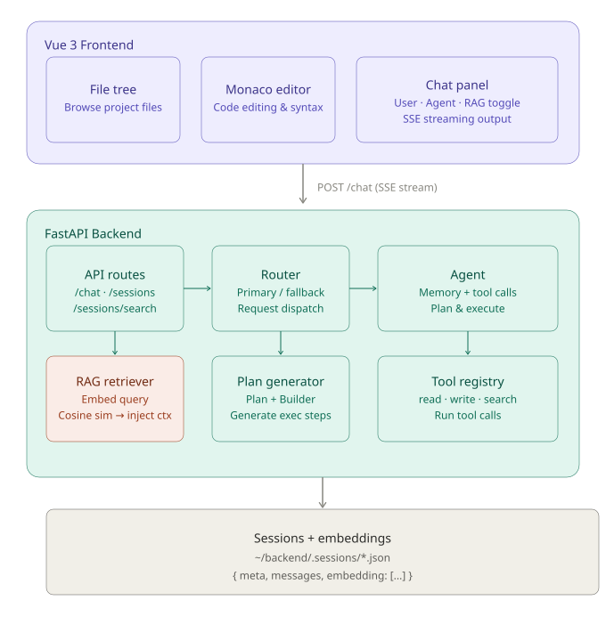

# MiniCode

[](https://www.python.org/)
[](https://vuejs.org/)
[](https://fastapi.tiangolo.com/)
[](LICENSE)

---

## I. Core Project Positioning

MiniCode is a lightweight, local-first AI programming assistant built with Vue3 + FastAPI.
It features streaming dialogue, tool invocation and RAG-powered cross-session memory.
The project supports automatic failover for multiple LLM providers and requires no database. All data is stored in local files.

---

## II. Overall Core Architecture

# My Project



### 1. Layered Architecture

```
Frontend (Vue3) ←SSE Streaming→ Backend (FastAPI) ←API→ Multiple LLM Service Providers
```

- **Frontend**: File tree, Monaco code editor, chat panel, session management
- **Backend**: API routing, LLM routing, intelligent agent, tool system, RAG memory, file storage
- **Storage**: No database. Sessions and embedding vectors are stored in JSON files.

### 2. Core Data Flow

1. User inputs content → Frontend sends SSE streaming request
2. Backend enables RAG (optional) → Retrieve historical session context
3. LLM generates responses with cyclic tool invocation supported
4. Stream results back to frontend → Real-time rendering & tool execution

---

## III. Core Backend Modules

### 1. Configuration Center (`config.py`)

- Unified management for LLM providers, API keys and model parameters
- Define agent constraints (max tool cycles & execution steps)
- Classify secure tools (read-only under Plan mode)

### 2. LLM Management

- **Base Provider Class**: Encapsulate common logic for streaming generation and vector embedding
- **Multi-provider Implementation**: Tongyi Qwen, GLM, DeepSeek
- **Routing Mechanism**: Auto switch to backup provider when primary service fails
- **Client**: Expose unified chat and embedding interfaces

### 3. Intelligent Agent

- Manage dialogue context and memory
- Control tool invocation loops to avoid infinite execution
- Two working modes: Build (full features) / Plan (read-only)
- Stream tokens, thinking logs and tool call events in real time

### 4. Tool System (Core Highlight)

- **Auto Discovery**: Load all tools automatically by scanning the `tools/` directory
- **Decorator Registration**: Register functions as AI tools via `@tool`
- **Auto Schema Generation**: Generate LLM tool descriptions from function signatures and docstrings
- **File System Tools**: Read / Write / Append / Delete / Directory traversal
- **Repository Tools**: Generate project structure, code map, repository backup
- **Search Tools**: Search by filename, content and code symbols
- **System Tools**: Execute shell commands

### 5. RAG Cross-Session Memory (Core Highlight)

- Auto generate text embedding vectors when saving sessions
- Match historical sessions via cosine similarity
- Inject retrieved context into prompts automatically
- Zero extra dependency: Use official LLM embedding APIs, no local vector database required

### 6. Session Management

- Store sessions in local JSON files: `~/minicode/backend/.session`
- Support CRUD, keyword search and semantic search
- Auto generate session titles and timestamps

---

## IV. Core Frontend Modules

### 1. Layout System

- 3-column adaptive layout: Sidebar (File Tree) + Editor + Chat Panel
- Drag-to-resize, fullscreen toggle, collapse/expand panels
- Dark theme with optimized code syntax highlighting

### 2. Core Components

- **Sidebar**: Folder selection & file tree rendering
- **Editor**: Monaco editor for code editing and diff comparison
- **Chat**: Streaming chat, Markdown rendering, one-click code copy
- **SessionPanel**: History session management & semantic search
- **InputBox**: Toggle modes with Tab, send messages with Enter

### 3. State Management

- Reactive states: Working mode, active file, code content, diff data, panel status
- Encapsulated actions: Mode switch, file selection, diff update

### 4. API Communication

- Streaming chat: Receive tokens and tool events via SSE
- Session API: Timeout control to prevent hanging requests
- Proxy: Frontend forwards requests to backend port 8000 via `/api`

---

## V. Core Technical Advantages

- **Zero Deployment Cost**: No database or local models needed, one-click startup
- **Dual-mode Security**: Read-only Plan mode prevents misoperation; Build mode for full capabilities
- **Automatic LLM Failover**: Switch providers automatically when service fails
- **Rich Tool Ecosystem**: 20+ out-of-the-box programming tools, easy to extend
- **Cross-session Memory**: RAG retrieves history context automatically
- **Fully Local**: All data stays on local devices for privacy protection

---

## VI. Quick Start

### 1. Environment Requirements

- Python 3.10+
- Node.js 20+
- Valid API keys for LLM service providers

### 2. Start Backend

```bash
cd backend
python -m venv .venv
# Activate virtual environment
pip install -e .
# Create .env file and configure API keys
```

### 3. Start Frontend

```bash
cd frontend/vue
npm install
```

### 4. One-click Launch

```bash
minicode
```

Backend (Port 8000) and Frontend (Port 5173) will start automatically. Open browser to access.

---

## VII. Extension Development

### 1. Add New AI Tools

1. Create a new module under `tools/`
2. Register function with `@tool` decorator
3. Complete function signature and docstring (for auto schema generation)
4. Restart service to take effect

### 2. Add New LLM Provider

1. Inherit `BaseProvider` and implement generation & embedding methods
2. Register provider in `main.py`
3. Add corresponding API key and endpoint in config

### 3. Customize Frontend

- Modify `App.vue` for layout adjustment
- Extend `Chat.vue` to add new features
- Customize theme styles

---

## VIII. Design Philosophy

- **Minimalism**: Less dependencies, simpler configuration, lower learning cost
- **Local-first**: Data localization, privacy as priority
- **Tool-driven**: Focus on programming assistance rather than pure chat
- **Extensibility**: Modular design for easy expansion of tools, LLMs and frontend
- **Practicality**: Solve real programming problems instead of fancy features

---

## License

MIT
